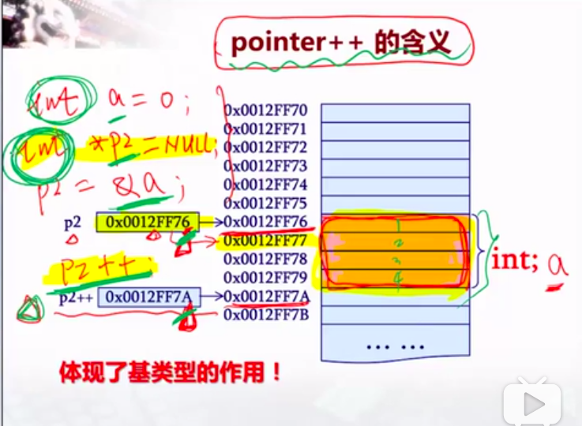
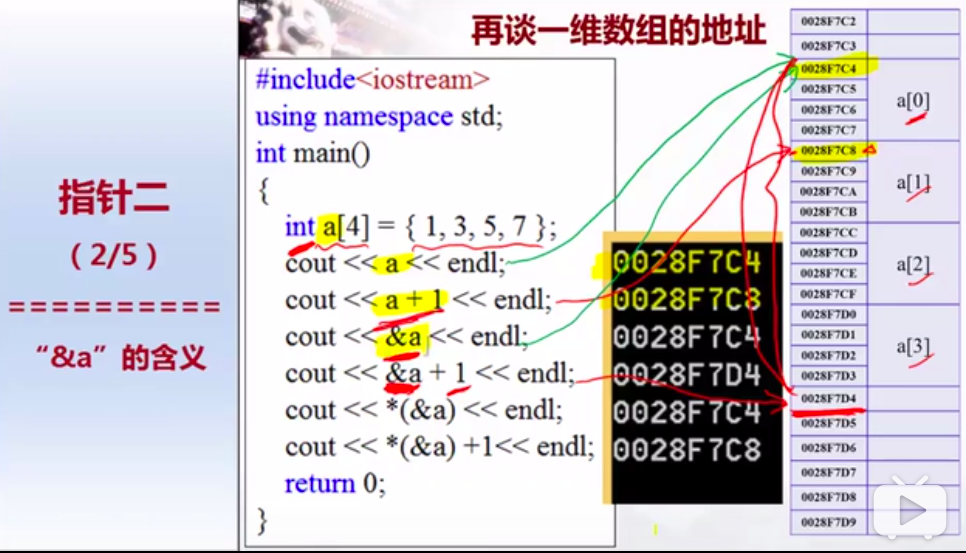
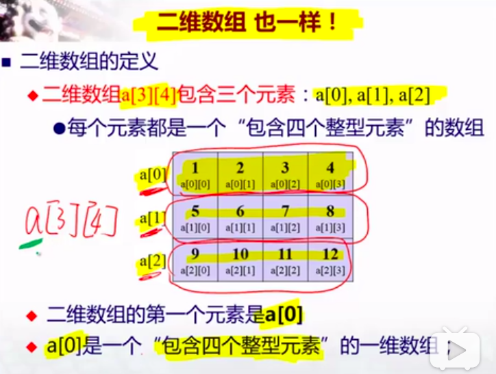
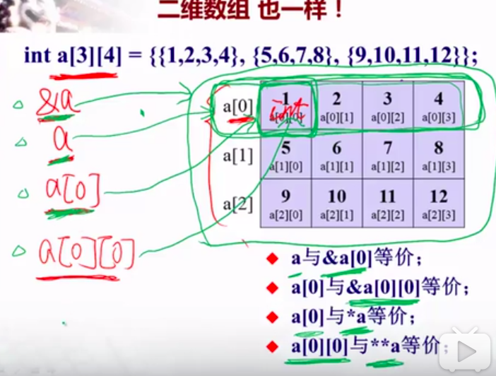

## 数组和指针

### 数组

- 定义：有两种方式，一个是给定 数组元素个数，另一个是 不显式的指定个数，但是在声明的时候必须初始化，通过初始化的个数来分配内存；
```cpp
int a[3] = {1, 2, 3}; // 也可以不初始化，后面再赋值
int b[] = {2, 4, 6};  // 必须初始化，否则编译不通过
int c[2][2] = {1, 2, 3, 4};
int e[2][2] = {{1, 2}, {3, 4}}; // 其中内部嵌套的{} 不是必须的，向上面的初始化完全等同
int d[][2] = {1, 2, 3, 4};  // 必须指定第二维的长度，否则后面的初始化不知道要分成维度大小多少
```

### 一维数组
- 数组名 和 指针
数组名代表数组**第一个元素**的首地址，但是数组名不是变量，可以对数组名进行运算，但不能进行赋值；可以将数组名赋值给指针，那么指针指向的就是该数组首元素的地址，指针变量，允许赋值操作，即：
```cpp
int a[3] = {1, 2, 3};
a++;    // 是不允许的，
cout<<"a1: "<<*a<<endl;
cout<<"a2: "<<*(a+1)<<endl; // 对数组a进行操作是允许的
int *p;
p = a;
p++;    // 允许赋值操作
cout<<*p<<endl;
```
Note:

**但是当数组作为函数参数的时候，c++ 编译器是将数组名转化为指针处理的，所以在函数内部，数组名当做指针使用，是可以进行赋值操作的；**
```cpp
#include <iostream>

using namespace std;

void foo(int a[]){
    a++;
    cout<<*a<<endl;
}
```

- 关于"&" 和 "*"  
数组、指针的**三条规律**:
    1. 数组名相当于指向数组第一个元素的指针；  但数组名不是变量，不能赋值操作，指针可以
    2. &E 相当于把E的管辖范围上升了一个级别；
    3. *E 相当于把E的管辖范围下降了一个级别；
先补充一个知识点，那就是指针步长的问题，指针步长是根据**基类型**来判定的，比如：
```cpp
int *p;
int a=0;
p = &a;
p++;    // 基类型是 int，int 占据4个长度的地址空间，所以 p++ 跳到了当前地址下面的第4个
```


下图中给出一个一维数组中关于 "&" 和 "*" 用法：

详细说明如下：  
1. a : 是数组首元素地址  
2. a+1 ：是第二个元素地址  
3. &a ：管辖范围上升一级，指向的是整个数组，即基类型是整个数组，虽然打印处来的仍然是第一个元素的地址，但基类型不同，所以地址跨度不同
  
4. &a + 1 ：因为 &a 是指向数组的，所以跨度如图所示，是跨过整个数组空间  
5. *(&a) ：*会将一级管辖，也就是回到了a，也就是数组首元素地址
6. *(&a) + 1 ：同理，是数组第二个元素的地址  


### 二维数组

- 定义：二维数组 a[3][4] 包含了3个元素：a[0], a[1], a[2]，也就是定义了3个包含4个元素的一维数组。
- 因为数组名代表了数组第一个元素的地址，所以我们要搞明白二维数组第一个元素的是什么？根据定义，第一个元素就是包含了4个元素的一维数组 a[0]  


- 代码中各指针的管辖范围(这里把数组名和取地址&当做指针,虽然不是变量)
    - &a : 指向整个二维数组，打印的结果是a[0][0]的地址
    - a：是指向一维数组a[0]的指针, 打印结果是a[0][0]的地址
    - 代码中 a[0] ：是指向一维数组a[0]的首元素的地址，也就是a[0][0]的地址
    - a[0][0] ：级别最低，只代表第一个元素数组中第一个元素的值；  
    

- 定义指向二维数组的指针  
我们想把二维数组的数组名赋值给指针，那么这两者要匹配，二维数组的数组名是一个指向首元素，即指向一个一维数组的指针，所以我们定义一个指向相同长度的一维数组的指针，具体例子：
```cpp
int a[][3] = {{1, 2, 3}, {4, 5, 6}};
int (*p)[3];    // 定义了指向长度为3的一维数组的指针
p = a;
cout<<p[1][0]<<endl;    // 输出是 4
```

### 生成动态数组
c++ 定义数组时，要明确给定数组的大小，不然编译不通过，但是在很多情况下，数组的长度是不能预先知道的，是在程序运行的时候动态的给出，这就要动态的生成数组，动态生成数组需要用 new 关键字;  
对于一维来说：
```cpp
int size = 5;
int *p = new int[size];
```
二维：
```cpp
int m=4, n=5;
//int (*p)[n] = new int[m][n];  // error，等号右边可以用new动态生成，不需要m,n是const，但是左边定义的指针数组的n必须是const，否则编译出错
// int **p 是二级指针，实际上定义的是这样的指针，int*(*p)，定义了int * 类型的指针(*p)， 而(*p)又定义了指向int 型的指针p
int **p = new int*[m];      // 通过指向指针的指针, (*p)定义的指针p对应的是长度是m的一维数组，也就是循环中的p[0]~p[m-1]，等号左边的 int* 和 右边的 int* 类型对应
for(int i=0; i<m; i++){
    p[i] = new int[n];
}
```
因为动态生成的数组实在堆(heap)上的，需要在用完后手动释放掉，否则程序在运行完毕前会一直占据内存空间，释放写法：
```cpp
    for(int i=0;i<size;i++){
        delete []  p[i];   // 要在指针前加[] ， 否则的话 只释放p[i]所指的第一个单元所占的空间
   }

   delete [] p;     //最后不要忘掉 释放掉开辟的指针数组
```

### 数组作为函数参数
上面已经提到，**在 c/c++ 中，数组作为函数参数，编译器是将数组名转化为指针处理的，在函数内部，数组名当做指针使用，是可以进行赋值操作的；**  
```cpp
#include <iostream>

using namespace std;

//void fun(int (*p)[3]){
//  cout<<p[0][0]<<endl;
//}

// 形参中定义的二维数组 a[][3]，其名a 在函数中就是指向第一个一维数组的指针，而不是相当于
void fun(int a[][3]){   // 上面注释掉的代码和该函数完全等同
    cout<<a[0][0]<<endl;
}

//void foo(int *p){
//    cout<<p[0]<<endl;
//}

void foo(int a[]){      // 上面代码等同
    cout<<a[0]<<endl;
}

int main(int argc, char * argv[]){

    int a[][3] = {{1, 2, 3}, {4, 5, 6}};
    int b[2] = {2, 4};
    fun(a);
    foo(b);
    return 0;
}
```
Note:  
既然foo的形参能够写成一级指针，对应一维数组，那么上面的fun函数的形参能否写成二级指针，从而对应二维数组呢？  
不行的！！！  
一维数组的数组名，就是指向一个整型元素的指针，这和 int *p 是完全对等的； 但是二维数组名，是一个指向首个一维数组的指针，而 int **p，是指向指针的指针，还是指向某一个地址，而不是指向数组的指针。
