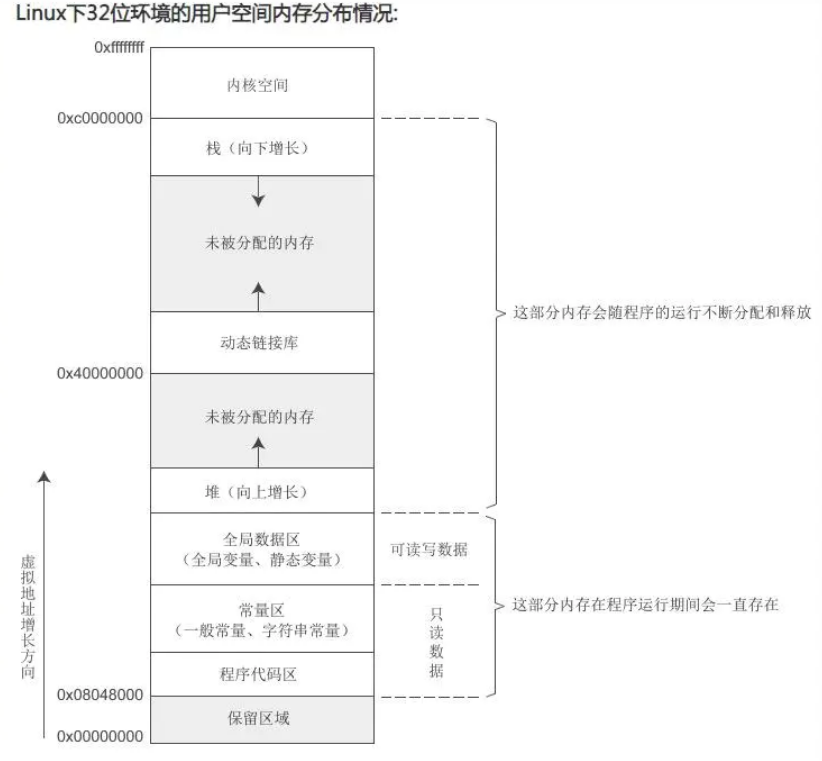

## 静态成员变量和函数

静态成员变量本质上是全局数据区，程序运行期间会一直存在。  

- static 成员函数和变量只是和类有关，数据分配在静态区。所有的对象共享一份，可以用 类名:: 或者 对象. 来调用。
- static 成员也只有私有和公有之分；
- static 修饰和 extern 作用相似，**并不是类型说明，而只是作用范围的说明**， 这和 const 修饰的有所不同。
    ```cpp
    class String{
        ...
        static int a;   // 并没有 static int 类型， 不像 const 修饰的，存在 const int 类型
        static void PirntValue(){cout<<a<<endl;}  // 并非返回值类型是static void, 而是说明该函数是静态函数，只能调用静态成员；
    }
    ```
- static 函数只能调用 static 成员，因为不属于对象，调用其他成员就相当于调用了对象，但static 函数可以在不创建对象的时候使用；  
- 需要在类外进行定义，因为放在构造函数中定义肯定不合适，另外，因为本质上是全局变量，就像用 extern 修饰的变量一样，在定义的时候，不需要再带 extern, static 变量，在类外定义的时候，不需要static 修饰，但是需要类的作用域说明空间范围；
    ```cpp
    #include <iostream>
    using namespace std;
    
    
    class CRectangle{
    private:
        int w, h;
        static int nTotalArea;
        static int nTotalNumber;
    
    public:
        CRectangle(int w_, int h_);     // 为了避免和成员变量名字相同，在成员变量名后加"_"是一个很好的命名方法；
        CRectangle(const CRectangle&);
        //CRectangle &operator=(const CRectangle&);
        ~CRectangle();
        static void PrintTotal();
    };
    
    CRectangle::CRectangle(int w_, int h_):w(w_),h(h_){
        nTotalNumber++;
        nTotalArea += w * h;
    }
    // 这里一定要写拷贝构造函数，因为并不是所有的对象都是用构造函数初始化的
    // 对于用其他对象初始化另一个对象，或者对象作为参数传递的时候，都是使用拷贝构造函数
    // 所以拷贝构造函数对总数和总面积做相应的改变
    // 当作为参数传递的时候，并不是想增加新的对象，只是想值传递，那么在拷贝构造函数中是不是总量
    // 增加的不合理？ 不是的，当该函数调用完毕，参数产生的临时变量会被销毁，这个时候调用析构函数，
    // 析构函数会将该对象对总量的影响给消去，所以不会有问题；否则在临时变量销毁的时候，总量就会减少，
    // 就会产生错误
    CRectangle::CRectangle(const CRectangle& C1){   
        w = C1.w;
        h = C1.h;
        nTotalNumber++;
        nTotalArea += w * h;
    }
    
    CRectangle::~CRectangle(){   // 销毁一个对象，要将总数和总面积相应的减少
        nTotalNumber--;
        nTotalArea -= w * h;
    }
    
    int CRectangle::nTotalNumber = 0;
    int CRectangle::nTotalArea = 0;
    
    void CRectangle::PrintTotal(){
        cout<<"total number: "<<nTotalNumber<<endl;
        cout<<"total area: "<<nTotalArea<<endl;
    }
    
    int main(int argc, char *argv[]){
        CRectangle r1(1, 2), r2(3, 4);
        CRectangle::PrintTotal();   // 等价于 r1.PrintTotal();
    
        return 0;
    }
    ```
    
