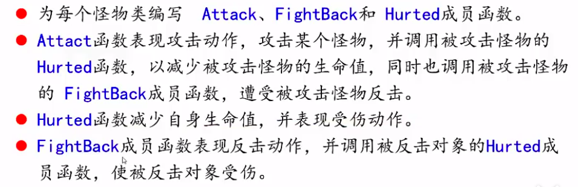
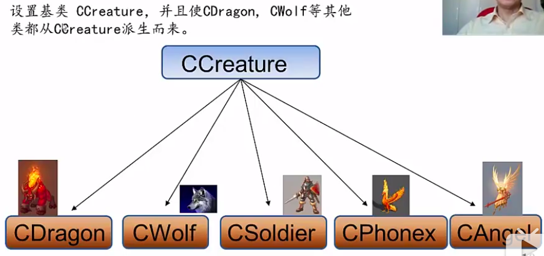

## 多态
C++ 关于类的4大特性：  
- 抽象：对实际问题进行分析，抽象为类
- 封装：将数据封装在类内部， 并通过访问控制符(private, protected)实现数据的隐藏
- 继承：现实世界中存在从属关系(如苹果属于水果)，继承就实现了这种关系，从未实现层级化管理
- 多态：一个操作随着所传递或捆绑的对象类型的不同能够做出不同的反应，其行为模式称为多态。c++使用滞后捆绑技术支持多态，这种技术通过预先设定其成员函数的虚函数性质，使得任何捆绑该成员函数的未定类型的对象操作在编译时，都以一个不确定的指针特殊的“引命待发”来编码，到了运行时，遇到确定类型的对象，才突然指定其真正的行为。即滞后到运行时根据具体类型的对象来捆绑成员函数。这样一来，辨别对象类型的工作就可以不用用户做了。  
    如果一种语言虽然支持继承，但不支持多态，则不能称为支持面向对象编程。

多态性(polymorphism)可以简单地概括为**“一个接口，多种方法”**，它是面向对象编程领域的核心概念。多态最常见的用法就是声明基类类型的指针，利用该指针指向任意一个子类对象，调用相应的虚函数，可以根据指向的子类的不同而实现不同的方法。如果没有使用虚函数的话，即没有利用C++多态性，则利用基类指针调用相应的函数的时候，将总被限制在基类函数本身，而无法调用到子类中被重写过的函数。因为没有多态性，函数调用的地址将是固定的，因此将始终调用到同一个函数，这就无法实现“一个接口，多种方法”的目的了。  

多态与非多态的实质区别就是函数地址是早绑定还是晚绑定。如果函数的调用，在编译器编译期间就可以确定函数的调用地址，并生产代码，是静态的，就是说地址是早绑定的。而如果函数调用的地址不能在编译器期间确定，需要在运行时才确定，这就属于晚绑定。

多态有一个概念：动态联编(绑定)，所谓动态就是在运行时候才能确定，而非编译的时候，联编就是绑定，也就是说一个操作(消息，也就是函数)的对象是在运行时候确定的，在编译的时候无法确定，比如基类的指针/基类的引用，因为派生类对象也是基类对象，所以当指针指向的是基类对象的时候，就调用的基类的成员函数，指针指向的是派生类的对象的时候，就调用派生类的成员函数。**而该指针指向的是什么对象，编译的时候是确定不了的，只有在运行的时候才能确定。**

**而该指针指向的是什么对象，编译的时候是确定不了的，只有在运行的时候才能确定。**关于这句话的理解，可以用下面的例子来说明：  
```cpp
#include <iostream>
using namespace std;

class Base{
    public:
        void display()const{
            cout<< "Base display()" <<endl;
        }
};

class Derived:public Base{
    public:
        void display()const{
            cout<< "Derived display()" <<endl;
        }
};
// 当 display 不声明是 virtual 函数的时候，ptr 不论指向的是基类对象还是派生类对象，
// 结果调用的都是基类的 display 函数；
//这里说明编译的时候，编译器是知道 display 函数绑定的对象的，就是函数指针类型岁对应的对象；
// 如果想实现调用的是调用的是派生类的 display ，那么要使用函数重载: void fun(Derived *ptr)；
//当然，另外一种方法就是使用虚函数，参见下面的修改

void fun(Base *ptr){    
    ptr->display();
}

int main(int argc, char *argv[]){
    Base ba;
    Derived de;
    fun(&ba);   // Base display
    fun(&de);   // Base display
    
    return 0;
}
```
将上面的 display 成员函数声明为 virtual 函数，那么在编译fun函数调用的时候，指针 ptr 所指向的对象不再确定是基类的对象，也就是说此时编译器已经确定不了 display 到底是基类的函数 or 派生类的函数，而是由运行过程中实参对象所确定。  
```cpp
#include <iostream>
using namespace std;

class Base{
    public:
        virtual void display()const{
            cout<< "Base display()" <<endl;
        }
};

class Derived:public Base{
    public:
        virtual void display()const{
            cout<< "Derived display()" <<endl;
        }
};

void fun(Base *ptr){    
    ptr->display();
}

int main(int argc, char *argv[]){
    Base ba;
    Derived de;
    fun(&ba);   // Base display
    fun(&de);   // Derived display
    
    return 0;
}
```
此处再强调多态是：一个接口，多种实现，这里的接口说的是例子中的fun 函数?

### 一个使用多态的例子  
设计一款游戏，有 dragon, wolf, soldier等角色，每个角色都有自己 攻击(Attack)，反击(fight back)，受伤(hurted) 等操作。具体要求和思路： 

  
非多态的实现方法：  
每一个角色类的 Attack , FightBack， Hurted 函数都要重载，因为这些函数的参数要匹配上其他不同的角色。
```cpp
#include <iostream>
using namespace std;

class Creature{
    protected:
        int nPower;
        int nLifeValue;
};

class Drogon:public Creature{

public:
    void Attack(Wolf *pWolf){   // 攻击 wolf
        pWolf->Hurted(nPower);   // wolf 受伤
        pWolf->FightBack(this);    // wolf 回击
    };
    void Attack(Ghost *pGhost){   // 攻击 wolf
        pGhost->Hurted(nPower);   // wolf 受伤
        pGhost->FightBack(this);    // wolf 回击
    };
    ... // 同样重载对其他角色的攻击 

    void Hurted(Wolf *pWolf){
        ...
    };
    void Hurted(Ghost *pGhost){
        ...
    };
    ... // 同样重载来自其他角色产生的伤害

    void FightBack(Wolf * pWolf){
        ...
    };
    void FightBack(Ghost *pGhost){
        ...
    };
    ... // 同样重载对自其他角色的反击
};
```
对于其他角色类，同样要像 Drogon 类那样写，如果新添加角色，那么要在所有已存在角色的类中都添加 Attack , Hurted,FightBack 函数，这样程序比较冗杂，并不容易扩展。解决的方法就是使用 virtual 函数，改写如下：  
```cpp
#include <iostream>
using namespace std;

class Creature{
    protected:
        int nPower;     // 受伤的时候造成伤害
        int nLifeValue;
    public:
        virtual void Attack(Creature *p){}
        virtual void Hurted(int power){}
        virtual void FightBack(Creature *p){}
};

class Drogon:public Creature{
public:
    virtual void Attack(Creature *p){   // 攻击其他角色
        p->Hurted(nPower);   // 角色 受伤
        p->FightBack(this);    // 角色 回击
    } 

    virtual void Hurted(int power){
        nLifeValue -= power;
    }

    virtual void FightBack(Creature * p){
        p->Hurted(nPower / 2);
    }
};

class Wolf:public Creature{
public:
    void Attack(Creature *p){   // 攻击 wolf
        p->Hurted(nPower);   // wolf 受伤
        p->FightBack(this);    // wolf 回击
    } 

    void Hurted(int power){
        nLifeValue -= power;
    }

    void FightBack(Creature * p){
        p->Hurted(nPower / 2);
    }
};

int main(int argc, char *argv[]){
    Drogon drog;
    Wolf wolf;
    drog.Attack(&wolf);     // Attack 中调用的是 Wolf 类的 hurted 和 fightBack，
    
    return 0;
}
```

补充：  
- 对于其他角色类，同样像 Drogon 类和 Wolf 类那样写就可以；如果新添加角色，那么已存在角色的类都不用改动，只要像 dragon 类一样编写就可以了。这大大的提高了程序的可扩展性和维护性。 
- Attack 函数实现了上文所说的：一个接口，多种方法。 当实参是 Wolf 类对象，调用的是 Wolf 中相应的函数，调用其他类对象，就相应的调用对应的函数。
- 上文也说了，基类中的虚函数，其派生类对应的函数也就自动为虚函数，可见，**基类和派生类虚函数的函数签名(function signature)(函数名、参数类型、参数个数以及顺序, 返回值可以不同)要一样的**，只有函数名相同是不够的(这是重载)，而虚函数要实现的是覆盖。


### 虚析构函数
从上面说，如果不使用多态，对与基类的指针，不论指向的是基类对象还是派生类对象，当用指针调用成员函数的时候，因为是基类指针，只会调用基类的成员函数；  
依照此逻辑，当基类的指针指向的在堆中(new 出来的派生类对象)分配的派生类对象，在调用析构函数的时，同样调用的只会是基类的析构函数，这就会造成空间释放不完全。  
我们的想法是：当销毁一个派生类对象时，先调用派生类的析构函数，在调用基类的析构函数。实现此方法，就是将析构函数声明为虚函数。  
```cpp
#include <iostream>
#include <string>
using namespace std;

class Son{
    public:
        virtual ~Son(){cout<< "son" <<endl;}
};

class GrandSon:public Son{
    ~GrandSon(){cout<< "GrandSon" <<endl;}
};

int main(int argc, char *argv[]){
    Son * ps;
    ps = new GrandSon;
    delete ps;  // son GrandSon

    return 0;
}
```

### 纯虚函数和抽象类

- 会存在这样的情景，那就是基类没有要生成的对象需求，但是想用多态特性，我们可以创建抽象类，该类不能用于创建对象，唯一的目的就是实现多态;
- 抽象类不可以创建对象，但是可以指向该类型的指针或者引用，否则就没法用多态了。多态就是靠函数中传基类指针或引用实现的；
- 抽象类：包含纯虚函数的类叫抽象类，所以抽象类中还可以有其他的成员变量和函数；
- 纯虚函数：虚函数在声明的时候初始化为0的函数；

``` cpp
class Shape{    // 抽象类
    public:
        virtual void Draw() = 0;    // 纯虚函数
};
```
对纯虚函数的理解： 函数名就是函数的地址，将一个函数初始化为0意味着将函数的首地址为0， 这就是告诉编译器：不要为该函数编址，从而阻止该类的实例化行为。在C++ 中， 只有虚函数才可以初始化为0。  
关于地址为0的理解，参看《NULL_nullptr》。


