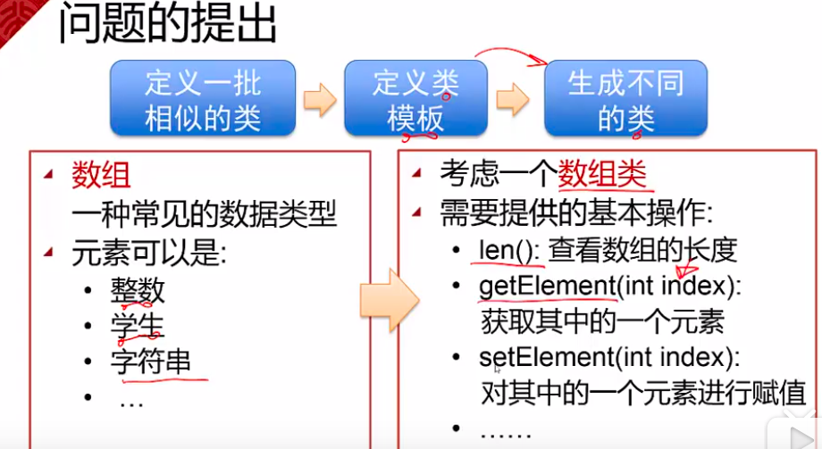

## 泛型编程

- C++ 支持泛型编程，所谓泛型编程就是使用模板，而模板就是抽象抽象了类型；
- C++ 泛型编程包括2部分： 函数模板、类模板

### 函数模板
 
如果让你去抽象出一个函数的模板来，你该怎么做？  
函数模板说到底是实现相同功能的函数的集合，只是函数操作的对象类型各有不同而已。比如一个交换两个变量值的 Swap 函数，这两个变量可以是 int 、float、string等类型，要想实现都可以交换，可以使用函数重载，但是这样需要为各种类型都写一个函数，显然不够简洁，最好的办法就是将这些类型抽象为一个 通用的类型(就是泛型)，那么一个函数就可以搞定了。
```cpp
#include <iostream>
#include <string>

using namespace std;

template<class T>
void Swap(T &x, T &y){
    T tmp = x;
    x = y;
    y = tmp;
}

int main(int argc, char *argv[]){
    int n=1, m=2;
    Swap(n, m);
    cout<<n<<endl;

    string s1 = "this";
    string s2 = "that";
    swap(s1, s2);
    cout<<s1<<endl;
    
    return 0;
}
```
- 因为 swap 函数是 c++ 函数库所提供的，如果自己定义名为 swap 的函数，会出现：“call of overloaded swap(int &, int &) is ambiguous" ，意思是调用重载的swap函数具有歧义性。  
- template<class T> 中的 class T 就是类型的抽象， T 可以代表任意类型，具体是哪一种类型，依据实际的实参类型而定；
- 当抽象类型不只一个时，可以依次在后面填充
    ```cpp
    template <class T1, class T2, ...>
    ```

### 类模板

同样从实际的角度来考虑，我们什么时候会需要类模板？参见：　　
     
下面给出一个例子：　　
```cpp
#include <string>
#include <iostream>
using namespace std;

template <class T1, class T2>
class Pair{
    public:
        T1 key;
        T2 value;
        Pair(T1 k, T2 v):key(k), value(v){}
        bool operator<(const Pair<T1, T2> &p)const;
};

//类外定义需要将类型也带上
template <class T1, class T2>
bool Pair<T1, T2>::operator<(const Pair<T1, T2> &p)const{
    return key < p.key;
}

int main(int argc, char *argv[]){
    Pair<string, int> student("tom", 19);
    cout<< student.key << "  " << student.value <<endl;

    return 0;
}
```
- 这里有一个概念要辨析： 类模板是类的模板，就是上面类模板的定义 Pair<class T1, class T2>，类模板的实例化叫模板类，即 Pair<string, int> 就是模板类，就是赋予了具体的类型，模板类多种多样，之间互不兼容，例如 Pair<string, int> 和 Pari<float, int> 就是两个不同的类

### string 类
string 类就是一个模板类，定义如下：　　
```cpp
typedef basic_string<char> string
```
通过typedef 将 模板类 basic_string<char> 重命令为string。可以知道 类模板 应该是下面的形式：
```cpp
template <class T>
class basic_string{
    ...
}
```
string 对象的初始化：
```cpp
string s1("hello");   // 一个参数的构造函数
string s2(8, 'x');     // 两个参数的构造函数
string s3 = "this";   // 使用了赋值运算符初始化
```


