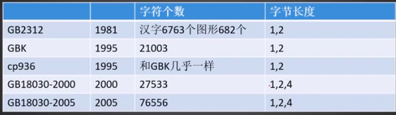
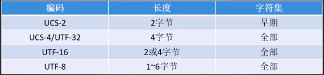

## 字符编码

字符编码分为两块，其中一个是字符集(编码)，另一个是编码实现方式(编码方式)，字符集就是字符的集合，比如 ASCII 码，包含了26个英文字符和其他符号(运算符号、标点符号等)和对应的在计算机中用二进制表示的数字，比如a 对应的码是97，在计算机中用二进制表示的97就对应了字符a。这里字符与码一一对应的关系是编码，但是在其实现方式会有不同，比如中文字符，有的会用2个字节来实现编码，有的会用3个。这就有了对于同一个字符集，有不同的编码方式，比如 Unicode 字符集，对应的编码方式有 utf-8, utf-16, utf-32等。  

- ASCII ： 因为编码方式只用一种，所以编码方式也用ASCII 来称呼，也就是说ASCII既表示字符集，也表示编码方式
- 因为中文字符集一开始老外没搞，那么中国人搞，从1981年开始，至2005年，添加进字符集的中文和符号越多，字符集也在扩大，出现了如下图中的各个字符集，因为每个字符集的编码方式只有一种，所以字符集的也代表了编码方式：  
  
    Note:  
    1. cp936 : 是 code page 936，是IBM　汇集了各国的字符编码，并稍加了修改；中文的字符编码在　code page 的936 页，当时收录的是GBK，并加了修改，所以说和GBK几乎一样。
    2. 从 ASCII、GB2313、GBK(cp936) 到 GB18030，这些编码是向下兼容的，也就是同一个字符在这些方案中总有相同的编码，越往后的标准支持的字符越多。
    3. 可以认为cp936就是GBK，两者编码的文件可以相互不用转码，也不会出现乱码

- 因为各国的字符集都不同，就想到用一个统一的字符集将所有的语言与符号都囊括在里面，以后各国都可以使用这一个字符集，将会极大方便编码问题(减少乱码和编码方式转换问题)，这个字符集就是 Unicode ，它规定了这个世界上所有语言符号的字符与在机器中对应的码，由于具体实现方式的不同，出现了:  
  
现在最常用的是 utf-8 编码方式。

## 乱码原因 和 解决方案

乱码一般是不同的操作系统(windows 一般使用的是cp936， linux 默认的是 utf-8)下编辑的文档，使用了不同的编码方式造成的问题，要想解决就要进行转码。  
- Linux 下查看系统默认编码的方式是: 
    ```cpp
    echo $LANG   // 系统默认的变量 LANG (language 缩写)
    ```
### vim 出现乱码解决方案
- vim 能够自动进行编码识别，是通过 set fileencodings来设置的，在vim 命令模式下输入下面命令可以查看编码识别的的类型和顺序：
    ```cpp
    :set fileencodings
    ```
    默认的类型不够，可以在 vim 的配置文件添加下面的语句：
    ```cpp
    set fileencodings=ucs-bom,utf-8,cp936,gb18030,big5,euc-jp,euc-kr,latin1
    ```
    Note:  
    1. 当用vim 打开文件时候，先用第一个编码进行解码，如果失败，则使用下一个，如果都不成功，就使用最后一个latin1，但是这个时候仍会出现乱码，这个很好解释，latin1是个通用的解码方式，而源文件不是该编码方式。具体说明参见[vim 乱码解决方案](http://edyfox.codecarver.org/html/vim_fileencodings_detection.html)
    2. 这种方式并没有改变 文件的编码方式，只是在 vim 用对应的编码方式打开，从而不出现乱码；当用 cat 查看文件时，依然会出现乱码，想要在linux下任何时候都不出现乱码，要进行编码转化  

### 文件编码转换
- 基本格式：
    ```cpp
    iconv  -f 原编码  -t 新编码   原文件 -o 新文件      // -f:from； -t: target; -o:output
    ```
    例如 windows 下a.txt文件传到 linux 中，在terminal 下输入
    ```cpp
    iconv -f cp936 -t utf8 a.txt -o b.txt  
    
    //iconv -f gbk -t utf8 a.txt -o b.txt   // 与上面等价，因为cp936 与 bgk 编码方式相同，可能只是几个特殊字符的差异，而特殊字符一般遇不到
    ```
    如果想要覆盖掉原文件，可将上面的 b.txt 写成 a.txt。  

- 如果文件不是cp936，如何查看文件的编码格式呢?  
    使用 file 命令，语法：
    ```cpp
    file -i a.txt
    ```
    有时候a.txt 中存在中文，输出的不是 gbk/cp936 或者其他中文编码，而是 ISO-8859-1，ISO-8859-1是单字节编码,是 ASCII 扩展(向下兼容ASCII码，也就是用ASCII编码的文件，用 ISO-8859-1 来解码是没有问题的，因为前者在后者中的编码方式一样)。它是没有中文编码的，但是可以通过一定的方式来存储中文编码，然后配合中文来解码就可以看到中文了。参见[解析 utf8 与 ISO-8859](https://blog.csdn.net/robertcpp/article/details/7837712)  
    比如这里 file -i a.txt 后，出现 ISO-8859-1， 用：
    ```cpp
    iconv -f ISO_8859-1 -t utf8 a.txt -o b.txt  
    cat b.txt   
    ```
    用 cat 查看后仍有乱码，说明其中有中文，用下面命令即可：
    ```cpp
    iconv -f cp936 -t utf8 a.txt -o b.txt  
    ```
    Note：
    - Latin1是ISO-8859-1的别名，有些环境下写作Latin-1


